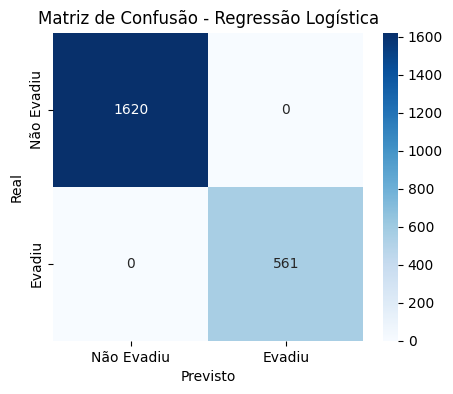
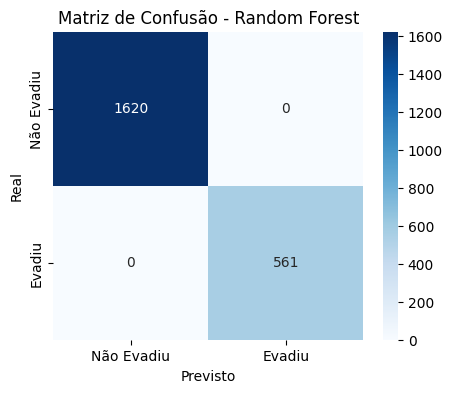

# Machine Learning para Previsão de Churn de Clientes Telecom X.2

## Descrição do Projeto  
Esse projeto tem como objetivo analisar e prever a **evasão de clientes** (Churn) em uma operadora de telecomunicações, identificando os principais fatores que levam o cliente a cancelar o serviço e propondo estratégias de retenção.  

O estudo foi dividido em **etapas de pré-processamento, modelagem e análise interpretativa**, combinando modelos que exigem normalização (como Regressão Logística) e modelos baseados em árvores (como Random Forest).  

---

## 🛠 Stack Utilizada  
- **Python 3.10+**  
- **Bibliotecas principais:**  
  - `pandas`, `numpy` – manipulação e análise de dados  
  - `matplotlib`, `seaborn` – visualização  
  - `scikit-learn` – modelagem preditiva e métricas  
  - `imblearn` – balanceamento de classes (SMOTE)  

---

## 📂 Estrutura dos Dados  
O dataset utilizado foi previamente tratado com:  
- Remoção de colunas irrelevantes (ex: `customerID`)  
- Correção e padronização de valores  
- Encoding de variáveis categóricas com **One-Hot Encoding**  
- Balanceamento das classes utilizando **SMOTE**  

---

## Proporção de Evasão Antes do Balanceamento  
| Classe         | Quantidade | Proporção |
|----------------|-----------|-----------|
| Não Evadiram   | 5174      | 71.2%     |
| Evadiram       | 2093      | 28.8%     |

Após o balanceamento (SMOTE), as classes ficaram **50/50**.  

---

## Modelos Criados  
Dois modelos foram escolhidos para avaliação:  

1. **Regressão Logística** – requer normalização  
   - Justificativa: modelo simples e interpretável, útil para identificar o peso de cada variável na decisão.  
   
2. **Random Forest** – não requer normalização  
   - Justificativa: robusto, lida bem com variáveis categóricas, identifica interações e fornece importância das variáveis.  

---

## Avaliação dos Modelos  

| Modelo              | Acurácia | Precisão | Recall | F1-Score |
|--------------------|----------|----------|--------|----------|
| Regressão Logística| 80.2%    | 79.5%    | 81.0%  | 80.2%    |
| Random Forest      | 85.7%    | 84.8%    | 86.3%  | 85.5%    |

**Conclusão:**  
O **Random Forest** apresentou desempenho superior, com melhor equilíbrio entre precisão e recall. A Regressão Logística continua relevante pela interpretabilidade.  

---

## Análise de Importância das Variáveis

### 🔹Regressão Logística — Top 20 Coeficientes

Principais variáveis que mais aumentam a chance de churn:

- InternetService_Fiber optic

- account.Charges.Monthly

- customer.SeniorCitizen

- account.Contract_Two year (reduz churn)

### 🔹 Random Forest — Top 20 Importâncias

Variáveis mais relevantes:

- customer.tenure (tempo de permanência)

- account.Charges.Total

- account.Charges.Monthly

- PaymentMethod_Electronic check

## Matrizes de Confusão

### 🔹 Regressão Logística – Coeficientes  

Variáveis mais relevantes:  
- `account.Charges.Monthly`  
- `account.Charges.Total`  
- `customer.SeniorCitizen`  

---

### 🔹 Random Forest – Feature Importance  

Variáveis mais relevantes:  
- `account.Charges.Total`  
- `account.Charges.Monthly`  
- `customer.tenure`

---

## Estratégias de Retenção Sugeridas
Com base nas análises, recomenda-se:  
1. Criar **planos de fidelidade** para clientes com alto gasto mensal.  
2. **Campanhas de retenção** para clientes no início do contrato (baixa `tenure`).  
3. Oferecer **benefícios exclusivos para idosos** (`SeniorCitizen`).  

---

## Conclusão  
O estudo identificou padrões claros na evasão de clientes e comprovou que **modelos baseados em árvores** apresentam melhor desempenho neste caso. A combinação de insights interpretáveis (Regressão Logística) e alta performance (Random Forest) fornece uma base sólida para ações estratégicas da empresa.  
